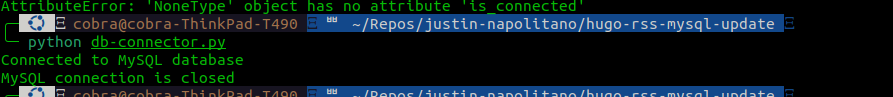

+++
title =  "Automate Posting Hugo Blog to Social Sites...with a db"
date = "2024-06-15"
description = "How To automate posting to social sites"
author = "Justin Napolitano"
tags = ['python', "hugo","programming","fail"]
images = ["images/feature-image.png"]
[extra]
lang = "en"
toc = true
comment = false
copy = true
outdate_alert = true
outdate_alert_days = 120
math = false
mermaid = false
featured = false
reaction = false
+++


## Background

In the previous few posts I detailed my progress in automating a site.  I am going about this by using an rss scraper to post new posts to social. 

I had initally thought about doing this really naively, but I want a database. It doesn't feel right without using one. I am somewhat upset with myself, because I am basically just recreating wordpress... but so it goes. 

### Previous posts in this series

1. [part 1](https://jnapolitano.com/en/posts/hugo-social-publisher/)
2. [part 2](https://jnapolitano.com/en/posts/python-rss-reader/)
3. [part 3](https://jnapolitano.com/en/posts/mysql-install-buntu/)
4. [part 4](https://jnapolitano.com/en/posts/mysql-config/)
5. [part 5](https://jnapolitano.com/en/posts/hugo-rss-setup/)

### Expand a previous script

In [a previous post](https://jnapolitano.com/en/posts/python-rss-reader/) I wrote about how to scan an rss feed on my personal site. In this post I will expand upon that to update some tables in a mysql database that I generated in [this post](https://jnapolitano.com/en/posts/mysql-config/)

## Add support for mysql 

### MySQL python connector manual 

* https://dev.mysql.com/doc/connector-python/en/connector-python-introduction.html


### Instal connector with pip

I created a virtual enviornment prior to starting this exercise. Review the [virtualenv documentation](https://virtualenv.pypa.io/en/latest/) for more information.  The source below is my path to thevirtualenviornment's bin.  

I am install the connector and the xdev extensions. TBH I do not know what the extensions are but i'm just going to go ahead and install them now before i write a script that ends up needing those extra libs. 

```bash

source ~/venvs/feedparser/bin/activate && pip install mysql-connector-python && pip install mysqlx-connector-python

```

### Install python-dotenv with pip

I plan to containerize this later. Using .env files formt he start will be a good way of making this portable later.  

```bash 

pip install python-dotenv

```

### Create a .env file with your environmental variables

```bash 
touch .env
```

```bash
vim .env
```

```vim

DB_USER=cobra 
DB_PASSWORD=password
DB_HOST=127.0.0.1
DB_NAME=posts

```

### Create a utility class to be able to reuse this code

#### connector method reference

```https://dev.mysql.com/doc/connector-python/en/connector-python-api-mysqlconnection.html```

Something like below is a good way to get started. 

```python
import mysql.connector
from mysql.connector import Error
from dotenv import load_dotenv
import os

class MySQLConnector:
    def __init__(self):
        self.user = os.getenv('DB_USER')
        self.password = os.getenv('DB_PASSWORD')
        self.host = os.getenv('DB_HOST')
        self.database = os.getenv('DB_NAME')
        self.connection = None

    def connect(self):
        try:
            self.connection = mysql.connector.connect(
                user=self.user,
                password=self.password,
                host=self.host,
                database=self.database
            )
            if self.connection.is_connected():
                print("Connected to MySQL database")
        except Error as e:
            print(f"Error while connecting to MySQL: {e}")

    def disconnect(self):
        if self.connection.is_connected():
            self.connection.close()
            print("MySQL connection is closed")

# Usage example
if __name__ == "__main__":
    load_dotenv()  # Load environment variables from .env file
    db = MySQLConnector()
    db.connect()
    db.disconnect()

```

### Verify that your server is running 

run..on most *nix-ish systems


```bash

systemctl status mysql

```

### Run your test program

>> Note do not call your class mysql.py... it will overwride the library and fail to import. 

```bash

python db-connector.py

```

#### Output

The output should look somethign like this...




